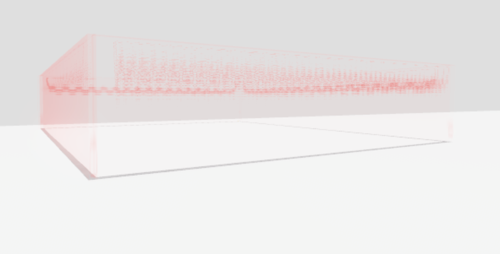

# 🔓 Box Lock System

<figure><figcaption>
Box Lock System
</figcaption></figure>


OPEN A TICKET IF YOU NEED TO SHARE SENSITIVE INFORMATION


1. **Open Game Settings**

2\. **Open the Security Tab**

3\. **Enable Allow HTTP Requests**

4\. **Insert the Product File into Studio**

5\. **Open the Files**

6\. **Open Group and change Value to your Group ID**

_Your GROUP ID are the numbers in your group link that are highlighted in **bold** in the example_ [_https://www.roblox.com/groups/**15943745**/Architech-Roblox_](https://web.roblox.com/groups/15943745/Architech-Roblox#!/about)

7\. **Open Rank and change Value to your Rank ID**

&#x20;_The Rank and all ranks above will be able to control the box_

_**Example:**_

Rank ID: `10` All people with the Rank ID 10-255 will be able to control the box

## AND WE'RE DONE!

Enjoy using the Box Lock System!

_Architech Executive Staff_
